# Uso e Importância do JUnit

## JUnit

JUnit é um framework que facilita o desenvolvimento e execução de testes unitários em código Java.

Fornece um conjunto de classes para construir os testes a serem executados.

Facilita a criação, execução automática de testes e apresentação dos resultados.

Já vem configurado nas versões recentes de IDE’s como Eclipse, NetBeans, JBuilder, BlueJ e outros.

Em outros casos, faça o download do arquivo junit.jar em www.junit.org.

## O Que São Testes Unitários?

Se um avião só fosse testado após a conclusão de sua construção... 

Com certeza isso seria um verdadeiro desastre, não é mesmo?

Por isso durante a construção e montagem de um avião todos os seus componentes são testados isoladamente até a exaustão, e depois cada etapa de integração também é devidamente testada e homologada.

O teste unitário, se baseia nessa ideia, pois é uma modalidade de testes que se concentra na verificação da menor unidade do projeto de software. 

É realizado o teste de uma unidade lógica, com uso de dados suficientes para se testar apenas a lógica da unidade em questão.

Em sistemas construídos com uso de linguagens orientadas a objetos, essa unidade pode ser identificada como um método, uma classe ou um objeto.

## Por Que Usar?

Principais Fatores:

- Previne contra o aparecimento de Bugs oriundos de códigos mal escritos;

- Código testado é mais confiável;

- Permite alterações sem medo;

- Testa situações de sucesso e de falha;

- Essencial para código coletivo, refatoração e integração contínua;

- Serve como métrica do projeto (teste == requisitos);

- Gera e preserva um “conhecimento” sobre as regras de negócios do projeto.

## Quando Implementar?

- Ao adicionar novas funcionalidades ao projeto, especialmente se interagem com outras partes do código.

- Operações que envolvam I/O ou que possam gerar efeitos colaterais.

- Situações críticas que necessitam robustez e adaptabilidade.

## Testes em Java

- Objetos: Testes unitários verificam se os objetos são criados corretamente e se seus estados e comportamentos estão de acordo com o esperado. Por exemplo, validam valores padrão de atributos ou o funcionamento de métodos relacionados a um objeto específico.

- Classes: Testam se a classe funciona como um todo, incluindo interações entre seus métodos e a consistência de seus estados internos. Além disso, validam herança, interfaces e polimorfismo.

- Métodos: Focam em verificar se um método individual produz o resultado esperado com diferentes entradas, considerando tanto os casos normais quanto os casos de erro.

## Testes Automatizados

- Geralmente focado em testes pontuais para garantir o funcionamento e segurança do sistema.

- JUnit possui ferramentas que possibilitam sua implementação.

## Anotações: 

- Como @Test para marcar um método como um teste, 

- @Before e @After para configurar e limpar o ambiente de testes, entre outras.

- (@Before e @After foram substituidos por @BeforeEach e @AfterEach no JUnit 5)

## Teste Unitário: O que testar?

### Dicas: 

A principal regra para saber o que testar é: “Tenha criatividade para imaginar as possibilidades de testes”;

- Comece pelas mais simples e deixe os testes “complexos“ para o final;

- Use apenas dados suficientes (não teste 10 condições se três forem suficientes);

- Não teste métodos triviais, tipo get e set;

- No caso de um método set, só faça o teste caso haja validação de dados;

## Implementando Testes 

- Defina o que testar (lista de tarefas);

- Escreva uma classe (test case) e um método de teste para uma tarefa da lista;

- Implemente um código simples para ser testado;

- Rode e refatore o código até estar robusto e passar no teste;

- Caso necessário, escreva mais um teste ou refine o existente;

- Faça esses passos para toda a lista de tarefas;

## Rodar Testes:

### Aqui vemos alguns comandos para rodar os testes implementados

nvm test

gradle test 

./gradlew test

gradle test --tests "GremioTest" --tests "VeiculoTest"

gradle test --info

gradle test --debug

gradle test --continue

gradle :modulo:test

gradle test -PincludeTags=rapido

#### Além dos comandos mencionados há IDEs que possuem um botão específico para rodar os testes

## Resultados:

O resultado da execução é mostrado no terminal, sinalizando se algum teste falhou.

Os resultados completos ficam salvos em um arquivo "index.html" dentro de uma pasta "reports" e podem ser expostos graficamente abrindo o arquivo em um navegador.

Também é possível usar comandos que detalhem o processo de execução dos testes, como as flags --info e --debug

## Classes implementadas

### Classe Animal
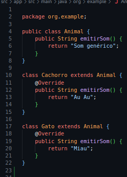

### Classe Conta Bancaria
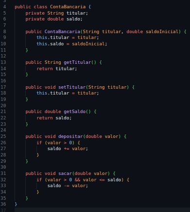

### Classe Veiculo
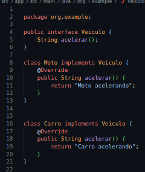

## Testes Implementados

### Teste Animal
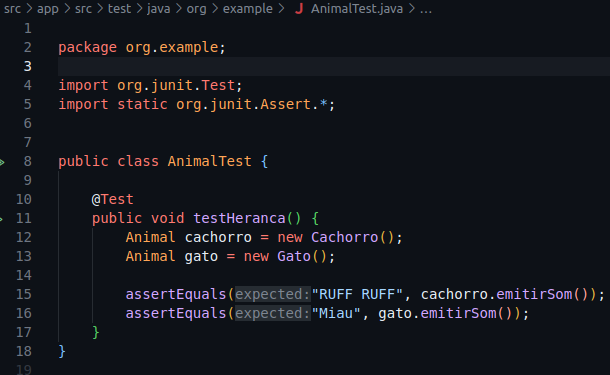

### Teste Conta
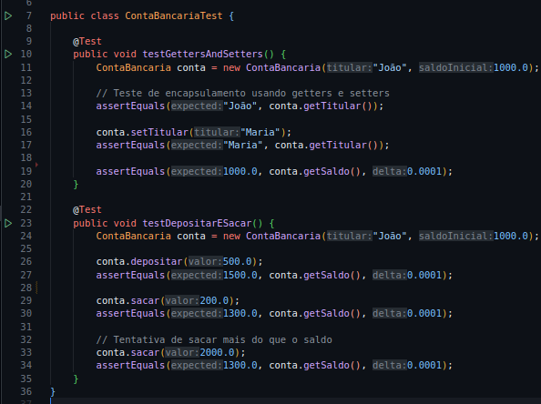

### Teste Veiculo
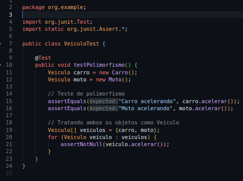

## Output Grafico

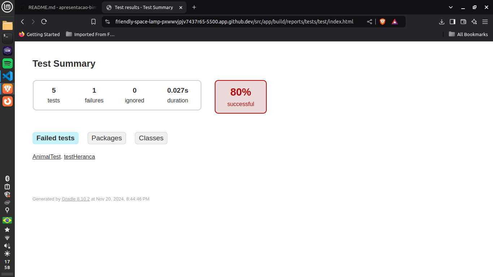

---------

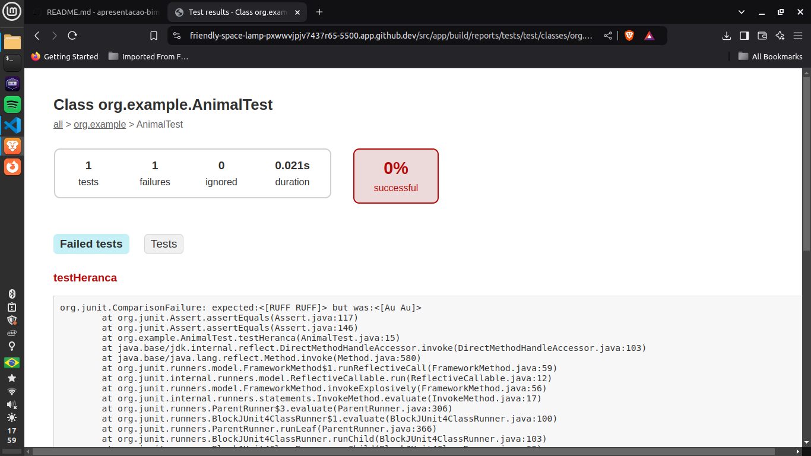

---------

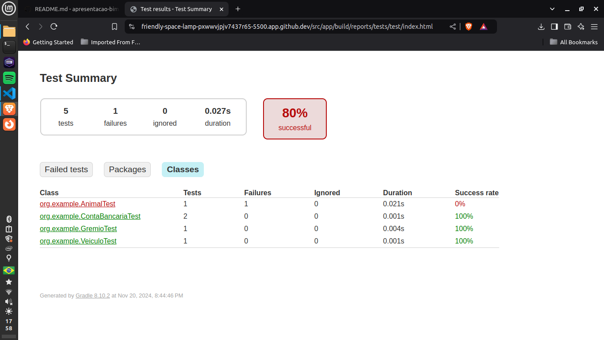

---------

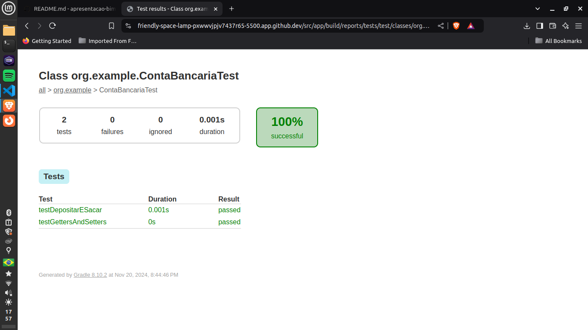

---------

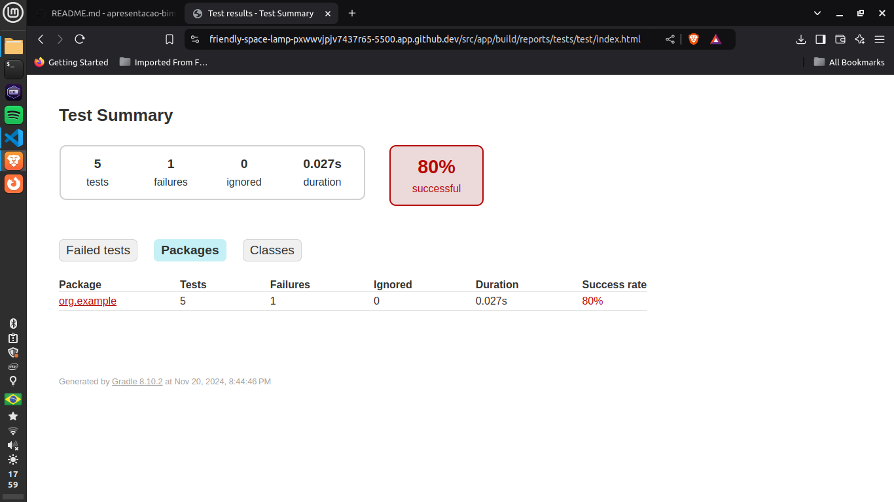

## Referências: 

### devmedia: 

https://www.devmedia.com.br/junit-tutorial/1432

https://www.devmedia.com.br/encapsulamento-polimorfismo-heranca-em-java/12991

https://www.devmedia.com.br/automacao-de-testes/10249

### mooc.fi

https://java-programming.mooc.fi/part-6/3-introduction-to-testing

